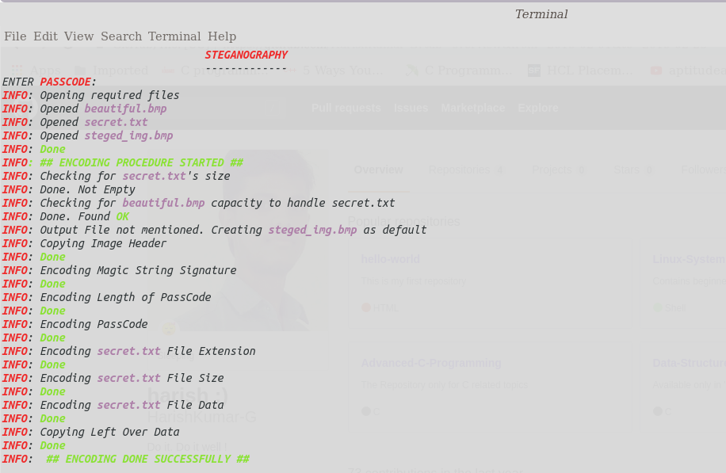
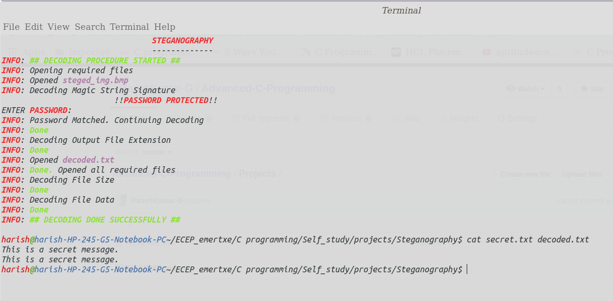

# Image-Steganography
A system, popularly used in cryptographic applications, which conceals confidential message that needs to be kept secret/transferred secretly. Here a text information is being concealed within an image.

Steganography(1)                HELP MENU

 Help menu for Steganography:

./lsb_steg: Encoding: ./lsb_steg -e <.bmp_file> <.text_file> [output file]
./lsb_steg: Encoding: ./lsb_steg -ep <.bmp_file> <.text_file> [output file]

./lsb_steg: Decoding: ./lsb_steg -d <.bmp_file> [output file]
                                                                    Steganography(1)

Encoder Console o/p:

Decoder Console o/p:

